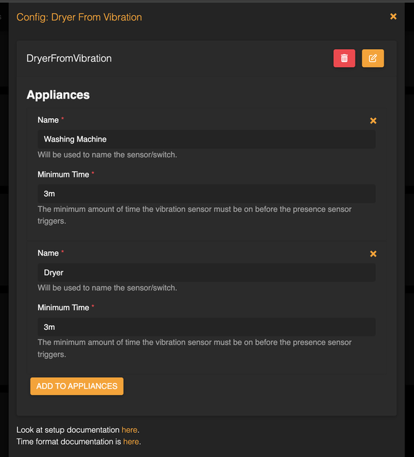
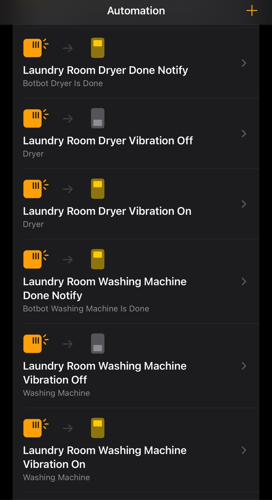

# Homebridge Plugin Dryer from Vibration

This is a homebridge plugin for setting up automations for a washing machine or 
dryer using a vibration sensor (such as this one from 
[Aqara](https://www.aqara.com/us/product/vibration-sensor/)).  It works by ignoring
triggers less than a certain amount of time (like when someone bumps into it), and
setting an occupancy sensor once the vibration sensor has been triggered for that
amount of time.  It's not very sophisticated, but it should work for most cases.

This plugin came about because the vibration sensor triggers immediately and only 
updates once a minute.  I needed something that would ignore the small triggers.

### Usage
Install the plugin in Homebridge, configure your appliances, and add it to your
Apple Home in the usual way.

In Apple Home, create automations like the following for a Dryer:
* Dryer Vibration On
  * When: your vibration sensor Detects Motion
  * Accessories: Turn On the Dryer switch
* Dryer Vibration Off
  * When: your vibration sensor Stops Detecting Motion
  * Accessories: Turn Off the Dryer switch
* Dryer Done Notify
  * When: Dryer Occupancy sensor Stops Detecting Occupancy
  * Accesories: whatever you want- pick a scene to change the color of lights, play something on HomePods, or use a (homebridge http switch)[https://github.com/Supereg/homebridge-http-switch#readme] to trigger an webhook.

My automations look like this:

